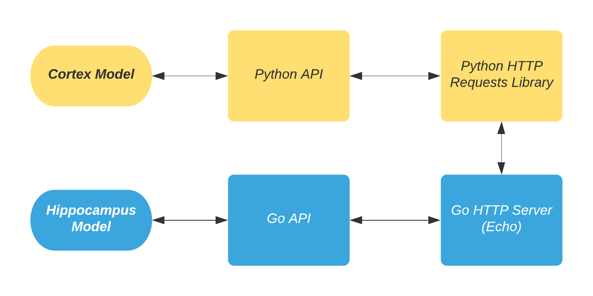
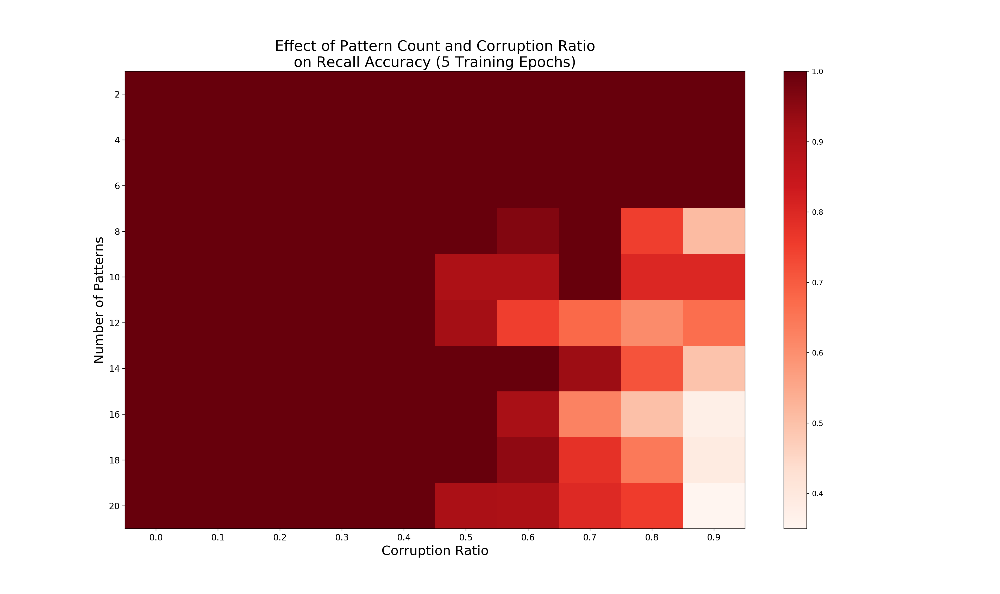

[Additional documentation on the Python code available here.](https://spolcyn.github.io/emergent-hc-rl/)

# Introduction

This repository presents a Python and HTTP REST interface for reinforcement learning using the Emergent hippocampus model as an environment. 
See the [Emergent Hippocampus Example](https://github.com/emer/leabra/tree/master/examples/hip) repository for more information about the model itself. 
The experiment used here as a tutorial for using the model tests the impact of removing data from the patterns and the effect of number of patterns the model must memorize on its recall performance.


# Interface Design

An HTTP server with a REST API forms the basis of the interface.
It accepts requests, takes the appropriate actions on the hippocampus model it controls, and then provides the desired response. 
This also makes it possible to interact with the model on a remote server, or to easily spin up several models on a local machine to parallelize across models. 
Additionally, a Python interface for the HTTP API is in `api.py` for easier Python development.

<!-- [More information about the high-level design is available in the paper, which can be found in docs/paper.pdf](docs/paper.pdf) -->

Generally, the API has 3 basic functions, with a 4th made up of a composition of the basic 3:
1. **Update Training Patterns** This operation accepts a set of patterns, encoded as a list of n-dimensional arrays and sets the model's training set to them.
2. **Start Training** This operation starts training the model on its current set of training patterns. The user may specify the number of epochs and runs the model trains for. It waits until the training completes, and returns the total time the training required.
3. **Test Pattern** This operation accepts as input a corrupted pattern and the original/target pattern. It then tests the model on the corrupted pattern, returning the distance between what the model recalled and the correct pattern, as well as the pattern in the training set closest to what the model recalled. 
4. **Step** This operation accepts as input a list of partial cues and a number of times to test each item, and returns the average reward for each partial cue (defined as *total number of neurons in the pattern - neurons recalled incorrectly*). This wraps the **Test Pattern** functionality in a method similar to OpenAI Gym models, and is largely provided as an example for users to write their own `Step` methods.



**Figure 1:** A diagram showing how a request flows through different components of the interface.

To use the interface, one first starts the HTTP server, which runs the model and handles API requests. Then, one uses Python code (or another language that interacts directly with the HTTP API) to interact with the server. 

The default location of the server is `localhost` on port `1323`, as these are the default ports for the Go Echo server used by the model server. They can be changed by editing `server.go`, and the `api.py` file should be updated to match the new settings.

# Setting Up the Model & Running the Experiment

Requirements:
- Go, version 1.13 or above
- Python
- Make

Getting Started:

1. Clone the repository:
`git clone git@github.com:spolcyn/emergent-hc-rl.git`

2. Run `make` to build the model.

3. Launch the model
    1. Use `./model.exe` to launch the model with the GUI (enables direct interaction, slower training when `View On` is true)
    2. Use `./model.exe nogui` to launch the model without the GUI (generally faster and requires fewer resources) 

4. Run the experiment: `python3 experiment.py` (takes ~6min on an i7-7820HQ, but could vary greatly depending on your processor)
    - The results will be saved in `results.npy`, which the `plot.py` code will read in to graph.
    - The results will also be displayed in the CLI as the average recall percentage across all patterns for each corruption ratio that was provided.
5. Graph the results: `python3 plot.py`




**Figure 2:** Sample experimental results showing recall drop-off as number of patterns and corruption ratio increase.

# Updating the `hip.go` File

Periodically, updates to the `hip.go` may come from the upstream Emergent
repository. Because of the design of the interface, most changes to the `hip.go`
code are relatively easy to apply (barring any serious changes in the underlying
variables and functions of the `hip.go` code). Below documents the changes that must be made to a new `hip.go` in order to support the interface:

1. Change the package from `main` to `hipmodel`.
2. Change the name of the `main()` function to `InitModel()`.
3. Add the following three lines to `InitModel()`, after `TheSim.New()` and `TheSim.Config()`:
```
// create the API server
server := HipServer{}
server.Init(":1323", &TheSim)
```
4. Add the following two lines to `type Sim struct {`:
```
// HIP RL Interface
NameErrorResult *NameError
``` 
5. Comment out (or delete) the code that starts training on the AC dataset to avoid unnecessary computation. 
These lines are in `TrainTrial()`, and the exact code may vary. Currently, it looks like this:
```
/*
    if ss.TrainEnv.Table.Table == ss.TrainAB && (learned || epc == ss.MaxEpcs/2) {
        ss.TrainEnv.Table = etable.NewIdxView(ss.TrainAC)
        learned = false
    }
*/
```
6. Comment out (or delete) the code that starts testing on the AC dataset to
   avoid unnecessary computation. Since the interface doesn't use the `TestAll()`
functionality, this should not be a concern. The current first and last few
lines are listed below; see this repository's `hip.go` for the full text:
```
/*
if !ss.StopNow {
    ss.TestNm = "AC"
    ss.TestEnv.Table = etable.NewIdxView(ss.TestAC)
...
...
        for {
            ss.TestTrial(true)
            _, _, chg := ss.TestEnv.Counter(env.Epoch)
            if chg || ss.StopNow {
                break
            }
        }
    }
}
*/
```
7. Comment out (or delete) the entire body of the `OpenPats()` method. Do not
   delete the method itself, as that will cause errors when the `Config()` function
tries to call it. Also, you may modify the code in that method to load the
files directly during model launch instead of using the API to instruct the model
to load the patterns from a file.
8. Comment out (or delete) the last part of the `CmdArgs()` method that
   configures the Epc and Run log and starts training, as we don't want to the
model to train without our express command, and we also don't use the Epc/Run log. 
The current first and last few lines are listed below; see this repository's
`hip.go` for the full text:
``` 
/*
if saveEpcLog {
    var err error
    fnm := ss.LogFileName("epc")
...
...
if ss.SaveWts {
    fmt.Printf("Saving final weights per run\n")
}
ss.Train()
*/
```

## Tips for Updating:
1. If you're familiar with `git`, using `git add --interactive` with the `patch` selection can be a very efficient way to apply just the desired updates to the API-compatible `hip.go`.
2. Regardless of `git` familiarity, the `diff` command is an effective way to see exactly what's different between an API-compatible `hip.go` and a new version of `hip.go`.

# Contributing

If something doesn't work the way you expected to or you have ideas for future improvements, please [open an issue](https://github.com/spolcyn/emergent-hippocampus-RL/issues) or submit a pull request.

# References

Emergent Hippocampus Model: https://github.com/emer/leabra/tree/master/examples/hip 
