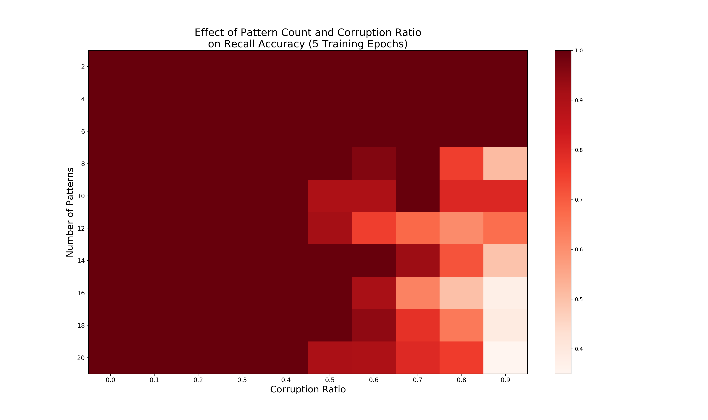

[Additional documentation available here.](https://spolcyn.github.io/emergent-hc-rl/)

# Introduction

This repository presents a Python and HTTP REST interface for reinforcement learning using the Emergent hippocampus model as an environment. 
See [Emergent Hippocampus Example](https://github.com/emer/leabra/tree/master/examples/hip) for more information about the model itself. 
The experiment used here as a tutorial for using the model tests the impact of removing data from the patterns and the effect of number of patterns the model must memorize on its recall performance.

# Interface Design

An HTTP server with a REST API forms the basic of the interface.
It accepts requests, takes the appropriate actions on the hippocampus model it controls, and then provides the desired response. 
This also makes it possible to interact with the model on a remote server, or to easily spin up several models on a local machine to parallelize across models. 
Additionally, a Python interface for the HTTP API is in `api.py` for easier Python development.

Generally, the API has 3 basic functions, with a 4th made up of a composition of the basic 3:
1. **Update Training Patterns** This operation accepts a set of patterns, encoded as a list of n-dimensional arrays and sets the model's training set to them.
2. **Start Training** This operation starts training the model on its current set of training patterns. The user may specify the number of epochs and runs the model trains for. It waits until the training completes, and returns the total time the training required.
3. **Test Pattern** This operation accepts as input a corrupted pattern and the original/target pattern. It then tests the model on the corrupted pattern, returning the distance between what the model recalled and the correct pattern, as well as the pattern in the training set closest to what the model recalled. 
4. **Step** This operation accepts as input a list of partial cues and a number of times to test each item, and returns the average reward for each partial cue (defined as *total number of neurons in the pattern - neurons recalled incorrectly*). This wraps the **Test Pattern** functionality in a method similar to OpenAI Gym models, and is largely provided as an example for users to write their own `Step` methods.

To use the interface, one first starts the HTTP server, which runs the model and handles API requests. Then, one uses Python code (or another language that interacts directly with the HTTP API) to interact with the server. 

The default location of the server is `localhost` on port `1323`, as these are the default ports for the Go Echo server used by the model server. They can be changed by editing `server.go`, and the `api.py` file should be updated to match the new settings.

# Setting Up the Model & Running the Experiment

Requirements:
- Go, version 1.13 or above
- Python
- Make

Getting Started:

1. Clone the repository:
`git clone git@github.com:spolcyn/emergent-hc-rl.git`

2. Run `make` to build the model.

3. Launch the model
    1. Use `./model.exe` to launch the model with the GUI (enables direct interaction, slower training when `View On` is true)
    2. Use `./model.exe nogui` to launch the model without the GUI (generally faster and requires fewer resources) 

4. Run the experiment: `python3 experiment.py` (takes ~6min on an i7-7820HQ, but could vary greatly depending on your processor)
    - The results will be saved in `results.npy`, which the `plot.py` code will read in to graph.
    - The results will also be displayed in the CLI as the average recall percentage across all patterns for each corruption ratio that was provided.
5. Graph the results: `python3 plot.py`

**Figure 1:** Sample experimental results showing recall drop-off as number of patterns and corruption ratio increase.

# References

Emergent Hippocampus Model: https://github.com/emer/leabra/tree/master/examples/hip 
